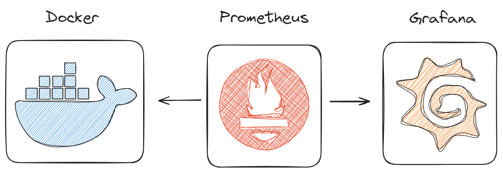
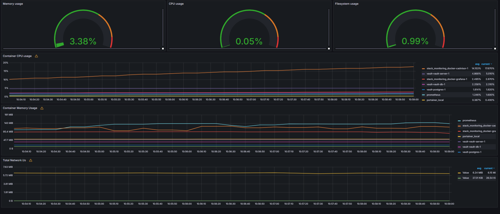

# Monitorando setup Docker com Prometheus e Grafana

## Arquitetura


## Pré-requisitos
* Docker

## Como desbloquear os pré-requisitos?
### Instalação do Docker: https://www.youtube.com/playlist?list=PLbPvnlmz6e_L_3Zw_fGtMcMY0eAOZnN-H

## Como subir a stack?
Faça clone do projeto
```
git clone https://github.com/wlcamargo/stack_monitoring_docker
```

entre na pasta e execute o comando para baixar as imagens e rodar os containers
```
cd stack_monitoring_docker
```

```
docker compose up -d
```

## Como acessar os serviços?

-------------------------------------
### Grafana

localhost:3000 

user: admin

password: admin

-------------------------------------

### Prometheus

localhost:9090

-------------------------------------

### Cadivisor

localhost:8083

-------------------------------------

## Como adicionar o dashboard ao Grafana?

* Step 1 --> Crie um fonte de dados com o Prometheus

* Step 2 --> Faça importação do arquivo json da pasta ```grafana```

### Dashboard Grafana


### Conclusão
Parabéns! o seu ambiente Docker já está sendo monitorado pelo Prometheus e o Dashboard mostrando os dados no Grafana. 

## Referências
https://github.com/vegasbrianc/prometheus/

## Developer
| Desenvolvedor      | LinkedIn                                   | Email                        | Portfólio                              |
|--------------------|--------------------------------------------|------------------------------|----------------------------------------|
| Wallace Camargo    | [LinkedIn](https://www.linkedin.com/in/wallace-camargo-35b615171/) | wallacecpdg@gmail.com        | [Portfólio](https://wlcamargo.github.io/)   |
